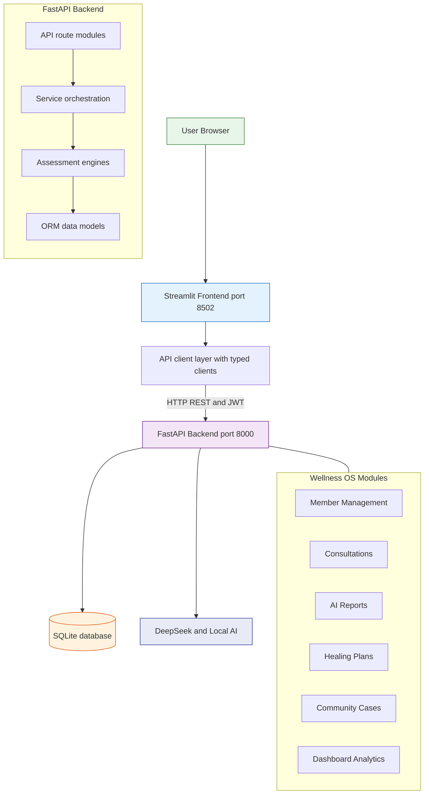

# AI Wellness OS

> **AI Wellness OS** is a bilingual (English / 中文) wellness management platform built for consultants, community health workers, and individuals who want to track health, analyse emotions, generate AI reports, and manage healing plans — all in one place.

[](https://github.com/thomasyeung79/health-risk-system/actions/workflows/backend-ci.yml)
[](CHANGELOG.md)
[](https://www.python.org/)
[](https://fastapi.tiangolo.com/)
[](https://streamlit.io/)
[](https://www.sqlite.org/)
[](https://opensource.org/licenses/MIT)
[](#testing)
[](docker-compose.yml)

## Live Demo

**Try AI Wellness OS online:** [https://ai-wellness.streamlit.app](https://ai-wellness.streamlit.app)

---



### v0.5 — Product Intelligence Architecture

```
┌─────────────────────────────────────────────────────────────┐
│                  Wellness Intelligence Layer                  │
├─────────────────┬─────────────────┬─────────────────────────┤
│  Pattern        │   Insights      │     AI Coach            │
│  Discovery      │   Dashboard     │     Daily Message       │
│  Engine         │   - Score       │     - Focus             │
│  - Sleep/Stress │   - Trends      │     - Habit             │
│  - Exercise/    │   - Changes     │     - Motivation        │
│    Energy       │   - Alerts      │     - Reminder          │
│  - Stability    │   - Focus       │                         │
│  - Diet/Energy  │   - Achievements│     Daily Reflection    │
│                 │                 │     - Went Well         │
│                 │                 │     - Challenge         │
│                 │                 │     - Gratitude         │
│                 │                 │     - Weekly Summary    │
└─────────────────┴─────────────────┴─────────────────────────┘
```

---

## Features

| Module | Description | Status |
|--------|-------------|--------|
| **🧠 Health Assessment** | 8-module health check (BMI, sleep, activity, diet, screen, stress, habits, mental) | ✅ Complete |
| **💭 Emotion Analysis** | 7-pattern emotion tracking with breathing exercises and reflection guidance | ✅ Complete |
| **📊 AI Reports** | Pluggable AI provider layer — RuleBased (default), OpenAI, DeepSeek | ✅ Complete |
| **📈 Trend Analysis** | 4-metric trend tracking with direction detection (improving/stable/declining) | ✅ Complete |
| **👥 Member Management** | Full CRUD for wellness members with multilingual profiles | ✅ Complete |
| **📋 Consultations** | Session tracking with type, concern, and questionnaire support | ✅ Complete |
| **🎯 Healing Plans** | Structured wellness plans with progress tracking and status management | ✅ Complete |
| **📂 Community Cases** | Anonymised case studies with public/private publishing | ✅ Complete |
| **🌱 Growth Journey** | Timeline-style personal wellness growth story combining health, emotion, consultations, reports, and plans | ✅ Complete |
| **🔄 Pattern Discovery** | Automatic behaviour pattern detection (sleep→stress, exercise→energy, health trajectory, emotional stability, diet→energy) | ✅ Complete |
| **📊 Insights Dashboard** | Wellness score, monthly trends, positive changes, risk alerts, recommended focus, achievements | ✅ Complete |
| **🎯 AI Coach** | Daily coaching messages with focus topic, habit suggestion, motivation, and wellness reminder | ✅ Complete |
| **📝 Daily Reflection** | Personal reflection entries with weekly summary generation and theme extraction | ✅ Complete |
| **🔐 Authentication** | JWT with bcrypt, refresh token rotation, and user-level data isolation | ✅ Complete |
| **🌐 Bilingual** | Full English and Chinese (中文) interface support | ✅ Complete |
| **🐳 Docker** | Docker Compose — one command to run the entire system | ✅ Complete |
| **✅ CI/CD** | GitHub Actions — 202 tests run on every push | ✅ Complete |

---

## Tech Stack

| Layer | Technology |
|-------|-----------|
| **Backend** | FastAPI 0.136+ / Python 3.12 / SQLAlchemy 2.0 / Alembic |
| **Frontend** | Streamlit 1.38+ / Pandas / Matplotlib |
| **Database** | SQLite (dev) → PostgreSQL (future) |
| **Auth** | JWT (python-jose) + bcrypt |
| **AI** | Pluggable AI provider layer: RuleBased (default), OpenAI, DeepSeek |
| **Testing** | pytest — tests across engine, service, API, client layers |
| **CI** | GitHub Actions |
| **Deployment** | Docker Compose + nginx |

---

## Screenshots

These screenshots are committed in `docs/screenshots/` and reflect the current Streamlit product flow.

| Screen | Preview |
|--------|---------|
| Login |  |
| Health Assessment |  |
| Emotion Analysis |  |
| Insights Report |  |
| Trend Analysis |  |
| Dashboard |  |
| AI Coach |  |

---

## Quick Start

### Prerequisites

- Python 3.12+
- Git
- (Optional) Docker Desktop

### Manual Setup

```bash
# Terminal 1 — Backend
cd AI_Wellness_Platform/backend
python -m venv .venv
.venv\Scripts\activate          # Windows
# source .venv/bin/activate     # macOS / Linux
pip install -e ".[dev]"
cp .env.example .env
uvicorn app.main:app --reload --port 8000

# Terminal 2 — Frontend
cd AI_Wellness_Platform
pip install -r requirements.txt
streamlit run web_v1.py --server.port 8502
```

### Docker (Recommended)

```bash
cd AI_Wellness_Platform
cp .env.docker.example .env
docker compose up
```

Open in browser:

| Service | URL |
|---------|-----|
| Frontend | http://localhost:8502 |
| Backend API | http://localhost:8000 |
| API Docs | http://localhost:8000/docs |

---

## Demo Credentials

| Role | Username | Password |
|------|----------|----------|
| **Administrator** | `admin` | `admin123` |
| **Demo User** | `demo_user` | `demo123456` |

---

## API Overview (25+ Endpoints)

All endpoints are prefixed with `/api/v1/`.

### Authentication

| Method | Path | Description |
|--------|------|-------------|
| POST | `/auth/register` | Create account |
| POST | `/auth/login` | Login |
| POST | `/auth/refresh` | Refresh token |
| POST | `/auth/logout` | Logout |
| GET | `/auth/me` | Current user |

### Core Wellness

| Method | Path | Description |
|--------|------|-------------|
| POST | `/health/check` | 8-module health check |
| POST | `/emotion/analyze` | Emotion analysis |
| POST | `/reports/generate` | AI wellness report |
| GET | `/trends/summary` | 4-metric trend summary |

### Wellness OS

| Method | Path | Description |
|--------|------|-------------|
| GET | `/dashboard/summary` | Aggregated dashboard |
| CRUD | `/members` | Member management |
| CRUD | `/consultations` | Consultation management |
| POST | `/ai-reports/generate` | Generate member AI report |
| CRUD | `/healing-plans` | Healing plan management |
| CRUD | `/community-cases` | Community case studies |
| POST | `/growth-journeys/generate` | Generate member growth journey |
| GET | `/growth-journeys` | List growth journeys (filterable by member_id) |
| GET | `/growth-journeys/{id}` | Get growth journey detail |
	| GET | `/patterns/{member_id}` | Discover behaviour patterns |
	| GET | `/insights/{member_id}` | Generate wellness insights |
	| GET | `/coach/daily/{member_id}` | Get daily coaching message |
	| POST | `/reflections` | Create daily reflection |
	| GET | `/reflections` | List reflections (filterable by member_id) |
	| GET | `/reflections/weekly-summary/{member_id}` | Get weekly reflection summary |

---

## Project Structure

```
AI_Wellness_Platform/
├── web_v1.py                    # Streamlit entry point
├── pages/                       # 8 page modules
│   ├── 0_Dashboard.py
│   ├── 0_Login.py
│   ├── 1_Health_Check.py
│   ├── 2_Mind_Reset.py
│   ├── 3_Wellness_History.py
│   ├── 4_Final_Report.py
│   ├── 5_AI_Coach.py
│   └── 7_Admin.py              # ← Wellness OS admin
│
├── api_client/                  # Typed HTTP client layer
│   ├── client.py                # Base client (JWT, auto-refresh)
│   ├── auth_client.py
│   ├── health_client.py
│   ├── emotion_client.py
│   ├── report_client.py
│   ├── trend_client.py
│   └── admin_client.py          # ← Wellness OS client
│
├── modules/                     # Shared modules
│   ├── ui.py                    # Product theme, nav, render components
│   ├── admin_ui.py              # Administration dashboard components
│   ├── coach_engine.py
│   ├── coach_memory.py
│   ├── dashboard_insights.py
│   ├── pdf_report.py
│   └── ...
│
├── backend/
│   ├── app/
│   │   ├── api/                 # 11 route modules
│   │   ├── models/              # 11 ORM models
│   │   ├── schemas/             # 7 Pydantic schema modules
│   │   ├── services/            # 7+ service modules
│   │   ├── engines/             # 9 assessment engines
│   │   └── tests/               # 202 tests
│   ├── alembic/                 # 5 migration scripts
│   ├── scripts/
│   │   ├── check_backend.py
│   │   └── seed_demo_data.py    # ← Demo data generator
│   └── data/                    # SQLite database
│
├── scripts/
│   └── seed_demo_data.py        # Populate with demo data
│
├── docker-compose.yml
├── Dockerfile
└── README.md
```

---

## Testing

```bash
# Backend (202 tests)
cd backend
pytest -v

# Health check
python scripts/check_backend.py

# Seed demo data
python scripts/seed_demo_data.py
```

| Layer | Tests | Scope |
|-------|-------|-------|
| Engines | 23 | Individual assessment module logic |
| Services | 11 | Orchestration and scoring |
| AI Providers | 15 | Provider fallback, factory, RuleBased/OpenAI/DeepSeek |
| API | 75+ | All 30+ endpoint integration tests |
| Auth | 20+ | JWT, registration, login, token refresh |
| User Isolation | 7 | Cross-user data access prevention |
| Wellness OS | 17 | Members, consultations, AI reports, cases |
| Growth Journey | 10 | Generate, list, detail, user isolation |
| Product Intelligence | 21 | Pattern Discovery, Insights, Coach, Reflections |

---

## Roadmap

| Phase | Status | Focus |
|-------|--------|-------|
| **v0.1** | ✅ Complete | FastAPI backend, health + emotion APIs, JWT auth |
| **v0.2** | ✅ Complete | AI reports, trend analysis, Docker, docs |
| **v0.3** | ✅ Complete | **Wellness OS** — Members, consultations, AI reports, healing plans, community cases, admin dashboard, demo data generator |
| **v0.4** | ✅ Complete | **AI Provider abstraction** (RuleBased/OpenAI/DeepSeek), **Growth Journey timeline** |
| **v0.5** | ✅ Complete | **Product Intelligence** — Pattern Discovery Engine, Insights Dashboard, AI Coach, Daily Reflection, Wellness Timeline upgrade |
| **v0.6** | ⏳ Planned | PostgreSQL migration, Next.js frontend, recommendation engine, real AI provider integration |

---

## License

MIT License. See [LICENSE](LICENSE) for details.

---

*Built with FastAPI, Streamlit, SQLAlchemy, and ❤️.*
