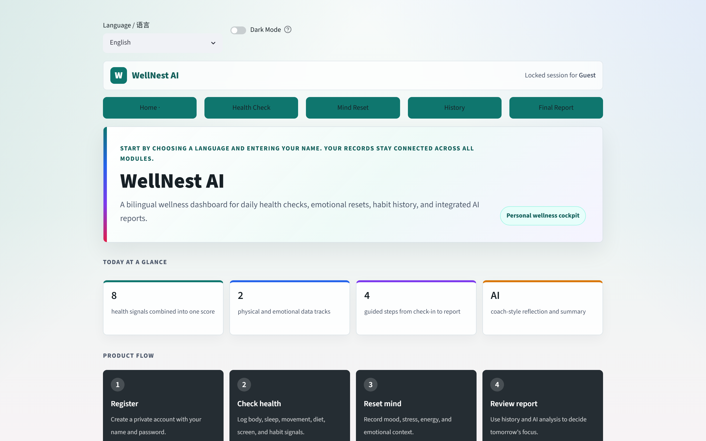
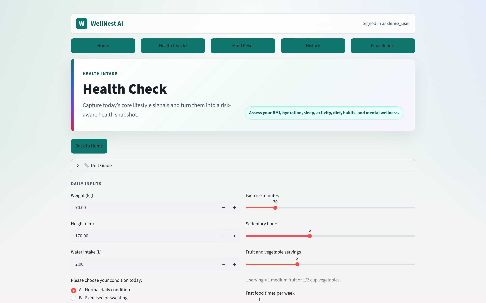
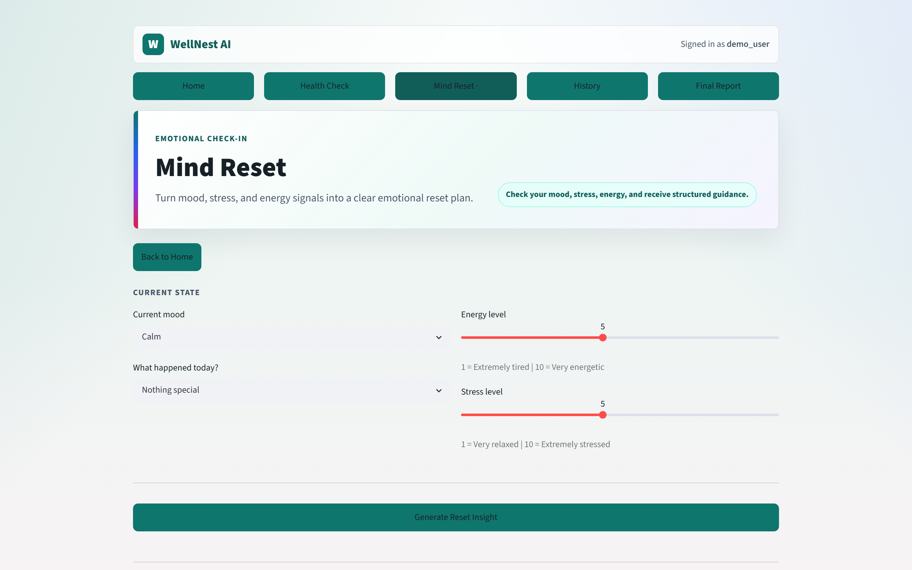
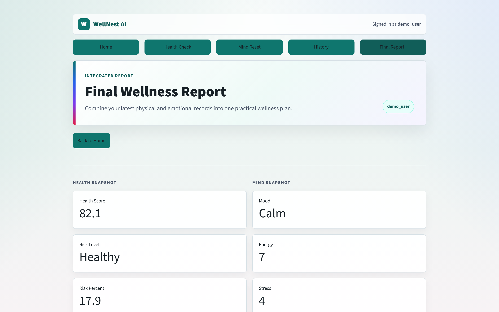
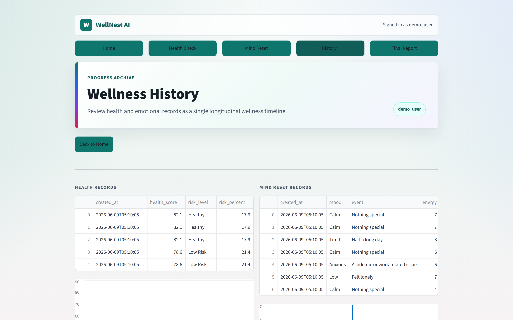
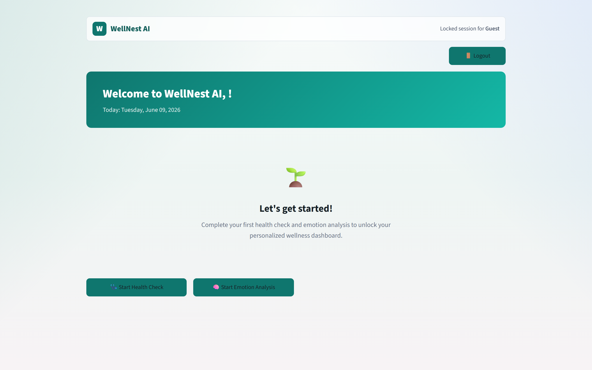
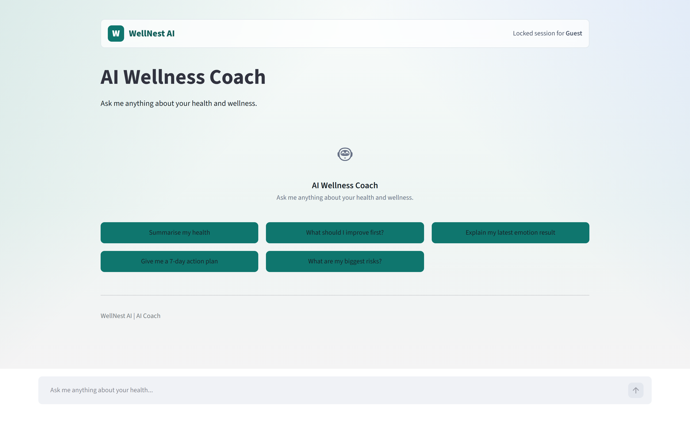

# AI Wellness Platform

> A bilingual (English / 中文) AI-powered wellness platform that combines **8-module health assessment**, **emotion analysis**, **trend tracking**, and **AI-generated wellness reports** into a single, privacy-first application.

[](https://github.com/thomasyeung79/health-risk-system/actions/workflows/backend-ci.yml)
[](CHANGELOG.md)
[](https://www.python.org/)
[](https://fastapi.tiangolo.com/)
[](https://streamlit.io/)
[](https://opensource.org/licenses/MIT)

---

## Architecture Overview

```
  User Browser
       │
       ▼
┌──────────────────────────────────────────────────────┐
│              Streamlit Frontend (port 8501)           │
│                                                       │
│  pages/  ←──  api_client/  (7 clients, JWT, auto-    │
│               refresh, unified error handling)        │
└──────────────────────┬───────────────────────────────┘
                       │ HTTP REST (JSON)
                       ▼
┌──────────────────────────────────────────────────────┐
│                FastAPI Backend (port 8000)             │
│                                                       │
│  14 API endpoints  │  6 database tables              │
│  4 service modules │  9 engine modules                │
│  202 tests         │  Alembic migrations              │
└───────────────┬──────────────────────┬────────────────┘
                │                      │
                ▼                      ▼
        ┌──────────────┐      ┌──────────────┐
        │   SQLite     │      │  DeepSeek /  │
        │   6 tables   │      │  Local AI    │
        │   79 columns │      │  (fallback)  │
        └──────────────┘      └──────────────┘
```

### Key Design Decisions

| Decision | Choice | Rationale |
|----------|--------|-----------|
| **Architecture** | API-first (Backend + Frontend) | Single source of truth, testable, deployable |
| **Frontend** | Streamlit (with API client) | Rapid prototyping, Python-only stack |
| **Backend** | FastAPI + SQLAlchemy | Industry standard, auto-docs, async ready |
| **Database** | SQLite (dev) / PostgreSQL (future) | Zero-config for development |
| **Auth** | JWT + bcrypt | Stateless, scalable, no session storage |
| **AI** | DeepSeek + local fallback | 1000x cheaper than OpenAI, automatic degradation |
| **Testing** | pytest (202 tests) | Engine → Service → API → Client full coverage |
| **CI** | GitHub Actions | Auto-run on every push |
| **Deployment** | Docker Compose | One command to run the entire system |

---

## Deployment

See the [Deployment Guide](docs/deployment.md) for step-by-step instructions to deploy to a production VPS.

| Environment | Status | URL |
|-------------|--------|-----|
| **Production** | ⏳ Planned | `https://wellness.thomasyeung.dev` |
| **API** | ⏳ Planned | `https://api.wellness.thomasyeung.dev` |
| **Staging** | 🟢 Local | `http://localhost:8501` |

---

## Screenshots









---

## Feature Matrix

| Category | Feature | Status | Notes |
|----------|---------|--------|-------|
| **Auth** | User Registration | ✅ Complete | bcrypt password hashing |
| | User Login | ✅ Complete | JWT access + refresh tokens |
| | Token Auto-Refresh | ✅ Complete | 401 → auto-refresh → retry |
| | User Isolation | ✅ Complete | user_id filtering at DB + API + Service layers |
| | Logout | ✅ Complete | Refresh token revocation |
| **Health** | BMI Assessment | ✅ Complete | WHO-based BMI categories |
| | Hydration Assessment | ✅ Complete | Weight + activity + urine analysis |
| | Sleep Assessment | ✅ Complete | Duration + interruptions + regularity |
| | Activity Assessment | ✅ Complete | Exercise + sedentary time |
| | Diet Assessment | ✅ Complete | Fruits, fast food, sugary drinks |
| | Mental Health | ✅ Complete | Mood, focus, physical symptoms |
| | Screen Time | ✅ Complete | Usage hours analysis |
| | Lifestyle Habits | ✅ Complete | Smoking, alcohol, late nights |
| | Interaction Risk | ✅ Complete | 8 cross-module interaction pairs |
| | Overall Scoring | ✅ Complete | 0-100 health score + risk level |
| **Emotion** | Mood Detection | ✅ Complete | 6 moods × 6 events |
| | Pattern Recognition | ✅ Complete | 7 emotional patterns |
| | Auto Topic Selection | ✅ Complete | Rule-based topic matching |
| | Breathing Exercises | ✅ Complete | 4 types of guided breathing |
| | Reflection Guidance | ✅ Complete | Contextual support + practice steps |
| | Full Story Generation | ✅ Complete | Structured emotional narrative |
| **Reports** | AI-Powered Report | ✅ Complete | DeepSeek integration |
| | Local Fallback Report | ✅ Complete | Zero-cost template fallback |
| | Report Caching | ✅ Complete | Same-day cache to avoid redundant API calls |
| | Download as Markdown | ✅ Complete | One-click report export |
| **Trends** | Health Score Trend | ✅ Complete | improving / stable / declining |
| | Stress Trend | ✅ Complete | 7-day window analysis |
| | Energy Trend | ✅ Complete | Direction + magnitude |
| | Sleep Score Trend | ✅ Complete | Module-level tracking |
| **History** | Health Records Table | ✅ Complete | Paginated, sorted |
| | Emotion Records Table | ✅ Complete | Paginated, sorted |
| | Trend Line Charts | ✅ Complete | Health score + stress visualization |
| | Radar Chart | ✅ Complete | 8-module wellness radar |
| | Data Export (CSV/JSON) | ✅ Complete | Download raw data |
| **Infra** | Dark Mode | ✅ Complete | CSS variable toggle |
| | Bilingual (EN/CN) | ✅ Complete | Full interface translation |
| | Docker Compose | ✅ Complete | One-command startup |
| | GitHub CI | ✅ Complete | Auto-test on push |
| | Alembic Migrations | ✅ Complete | 4 migration scripts |
| | API Documentation | ✅ Complete | Auto-generated Swagger UI |

---

## Tech Stack

| Layer | Backend | Frontend |
|-------|---------|----------|
| **Framework** | FastAPI 0.136+ | Streamlit 1.38+ |
| **Language** | Python 3.12+ | Python 3.12+ |
| **Database** | SQLite (SQLAlchemy 2.0 + Alembic) | — |
| **API Validation** | Pydantic v2 | — |
| **Authentication** | JWT (python-jose) + bcrypt | api_client (auto-refresh) |
| **AI Provider** | DeepSeek + Local Template Fallback | — |
| **Testing** | pytest (183 tests) | pytest (19 tests) |
| **CI** | GitHub Actions | — |
| **Containerization** | Docker (python:3.12-slim) | Docker (python:3.12-slim) |
| **Orchestration** | Docker Compose | Docker Compose |

---

## Quick Start

### Prerequisites

- Python 3.12+
- Git
- (Optional) [Docker Desktop](https://www.docker.com/products/docker-desktop/) for Docker mode

### Option 1: Manual Setup (Development)

**Terminal 1 — Backend:**

```bash
cd AI_Wellness_Platform/backend
python -m venv .venv

# Windows
.venv\Scripts\activate
# macOS/Linux
# source .venv/bin/activate

pip install -e ".[dev]"
cp .env.example .env
uvicorn app.main:app --reload --port 8000
```

**Terminal 2 — Frontend:**

```bash
cd AI_Wellness_Platform
python -m venv .venv

# Windows
.venv\Scripts\activate

pip install -r requirements.txt
streamlit run web_v1.py --server.port 8501
```

**Open in browser:**
- Frontend: http://localhost:8501
- Backend API: http://localhost:8000/docs (Swagger UI)

### Option 2: Docker Compose (Recommended)

```bash
cd AI_Wellness_Platform
cp .env.docker.example .env
# Edit .env to add your DEEPSEEK_API_KEY (optional)
docker compose up
```

**Open in browser:**
- Frontend: http://localhost:8501
- Backend API: http://localhost:8000/docs

---

## API Overview

All API endpoints are prefixed with `/api/v1/`. Interactive documentation is available at `/docs` when the backend is running.

### Authentication (`/api/v1/auth`)

| Method | Endpoint | Description |
|--------|----------|-------------|
| `POST` | `/api/v1/auth/register` | Create a new user account |
| `POST` | `/api/v1/auth/login` | Authenticate and receive JWT tokens |
| `POST` | `/api/v1/auth/refresh` | Exchange refresh token for new tokens |
| `POST` | `/api/v1/auth/logout` | Revoke refresh token |
| `GET` | `/api/v1/auth/me` | Get current user profile |

### Health Check (`/api/v1/health`)

| Method | Endpoint | Description |
|--------|----------|-------------|
| `POST` | `/api/v1/health/check` | Run full health assessment (8 modules) |
| `GET` | `/api/v1/health/records` | List health records (paginated) |
| `GET` | `/api/v1/health/records/{id}` | Get single health record |
| `GET` | `/api/v1/health/stats` | Aggregated health statistics |

### Emotion Analysis (`/api/v1/emotion`)

| Method | Endpoint | Description |
|--------|----------|-------------|
| `POST` | `/api/v1/emotion/analyze` | Run emotion analysis |
| `GET` | `/api/v1/emotion/records` | List emotion records (paginated) |
| `GET` | `/api/v1/emotion/records/{id}` | Get single emotion record |
| `GET` | `/api/v1/emotion/stats` | Aggregated emotion statistics |

### Wellness Report (`/api/v1/reports`)

| Method | Endpoint | Description |
|--------|----------|-------------|
| `POST` | `/api/v1/reports/generate` | Generate AI wellness report |
| `GET` | `/api/v1/reports` | List generated reports |
| `GET` | `/api/v1/reports/{id}` | Get single report |

### Trend Analysis (`/api/v1/trends`)

| Method | Endpoint | Description |
|--------|----------|-------------|
| `GET` | `/api/v1/trends/summary` | Get trend summary for core metrics |

**Total: 14 API endpoints**

---

## Project Structure

```
AI_Wellness_Platform/
│
├── web_v1.py                    # Streamlit entry point
├── pages/                       # Streamlit page modules
│   ├── 0_Login.py               #   Login / Register (API-first)
│   ├── 1_Health_Check.py        #   Health assessment (API-first, legacy fallback)
│   ├── 2_Mind_Reset.py          #   Emotion analysis (API-first, legacy fallback)
│   ├── 3_Wellness_History.py    #   History & trends (API-first, legacy fallback)
│   └── 4_Final_Report.py        #   AI report + charts (API-first, legacy fallback)
│
├── api_client/                  # HTTP client layer (JWT, auto-refresh)
│   ├── client.py                #   Base ApiClient (shared session)
│   ├── auth_client.py           #   Auth endpoints
│   ├── health_client.py         #   Health endpoints
│   ├── emotion_client.py        #   Emotion endpoints
│   ├── report_client.py         #   Report endpoints
│   └── trend_client.py          #   Trend endpoints
│
├── modules/                     # Legacy fallback engines (not actively maintained)
├── database.py                  # Legacy data access (fallback only)
│
├── backend/
│   ├── app/                     # FastAPI application
│   │   ├── main.py              #   Entry point, CORS, lifespan
│   │   ├── config.py            #   pydantic-settings
│   │   ├── database.py          #   SQLAlchemy engine + session
│   │   ├── models/              #   5 ORM models (6 tables)
│   │   ├── schemas/             #   Pydantic request/response models
│   │   ├── api/                 #   Route handlers (no business logic)
│   │   ├── services/            #   Business logic orchestration
│   │   ├── engines/             #   9 assessment engines (health + emotion)
│   │   └── tests/               #   183 tests across 12 files
│   ├── alembic/                 # Database migrations
│   ├── scripts/                 # Utility scripts
│   └── data/                    # SQLite database file
│
├── docker-compose.yml           # Docker orchestration
├── Dockerfile                   # Frontend container
├── .dockerignore
├── .env.docker.example          # Docker environment template
├── requirements.txt             # Frontend dependencies
│
├── tests/                       # API client tests (19 tests)
├── README.md
└── CHANGELOG.md
```

---

## Testing & Quality

| Test Suite | Location | Count | Run Command |
|-----------|----------|-------|-------------|
| **Backend** (engine → service → API) | `backend/app/tests/` | **183** | `pytest` |
| **API Client** (mock backend) | `tests/` | **19** | `pytest tests/` |
| **Total** | | **202** | |

```bash
# Run all backend tests
cd AI_Wellness_Platform/backend
pytest -v

# Run API client tests
cd AI_Wellness_Platform
pytest tests/ -v

# Run health check script
cd AI_Wellness_Platform/backend
python scripts/check_backend.py
```

### CI/CD

Every push to `main` triggers GitHub Actions which:
1. Installs dependencies
2. Runs all 202 tests
3. Runs the backend health check script

[](https://github.com/thomasyeung79/health-risk-system/actions/workflows/backend-ci.yml)

---

## Environment Variables

### Backend (`backend/.env`)

| Variable | Required | Default | Description |
|----------|----------|---------|-------------|
| `DEEPSEEK_API_KEY` | ❌ | — | DeepSeek API key (without this, local fallback reports are used) |
| `JWT_SECRET` | ✅ | `dev-secret-change-in-production` | JWT signing key |
| `DATABASE_URL` | ❌ | `sqlite:///./data/ai_wellness.db` | Database connection string |
| `JWT_ALGORITHM` | ❌ | `HS256` | JWT signing algorithm |
| `ACCESS_TOKEN_EXPIRE_MINUTES` | ❌ | `30` | Access token lifetime |
| `REFRESH_TOKEN_EXPIRE_DAYS` | ❌ | `7` | Refresh token lifetime |

### Frontend (`api_client` reads from environment)

| Variable | Required | Default | Description |
|----------|----------|---------|-------------|
| `API_BASE_URL` | ❌ | `http://localhost:8000` | Backend API URL |

### Docker (`docker-compose.yml` reads from `.env`)

Copy `.env.docker.example` to `.env` and edit:

```bash
cp .env.docker.example .env
```

Required variables:
- `DEEPSEEK_API_KEY` — Optional; AI report generation. Without it, local template reports are used.
- `JWT_SECRET` — Change this in production to a random 64-character string.

---

## Known Limitations

### Current (MVP Stage)
- **SQLite** — Suitable for single-user and development. For production, migrate to PostgreSQL.
- **Streamlit Frontend** — Appropriate for demos and internal tools. A professional frontend (Next.js) is planned.
- **No Live Deployment** — Currently runs only on localhost. Deployment is the next milestone.
- **Bilingual Only** — Supports English and Chinese. Korean (한국어) support is planned.

### Technical Debt
- `modules/` and `database.py` are retained as legacy fallbacks but no longer actively maintained.
- Several dead-code functions remain in `pages/4_Final_Report.py` (e.g., `generate_final_report()`).

---

## Roadmap

### Phase A — Backend Foundation (✅ Complete)
- ✅ Health assessment API (8 modules)
- ✅ Emotion analysis API (7 patterns)
- ✅ JWT authentication + user isolation
- ✅ AI-powered wellness report (DeepSeek + cache)
- ✅ Trend analysis (4 core metrics)
- ✅ GitHub CI + Docker Compose

### Phase B — Deployment & Polish (⬅️ Current)
- [ ] Docker Compose production configuration (nginx + SSL)
- [ ] Live deployment (VPS / Railway)
- [ ] Legacy code cleanup
- [ ] End-to-end Playwright tests
- [ ] Performance optimization

### Phase C — Advanced Features
- [ ] Correlation analysis (sleep vs stress, exercise vs mood)
- [ ] Warning engine (proactive health alerts)
- [ ] Korean language (한국어) support
- [ ] Data migration script (JSON → PostgreSQL)

### Phase D — Professional Frontend
- [ ] Next.js frontend (Tailwind CSS + shadcn/ui)
- [ ] Mobile-responsive design
- [ ] Progressive Web App (PWA)

---

## Deployment Safety Checklist

Before deploying to production, verify these items:

### Required
- [ ] `JWT_SECRET` is set to a random 64-character string (run `python -c "import secrets; print(secrets.token_hex(32))"`)
- [ ] `DEBUG` is set to `false`
- [ ] `CORS_ORIGINS` is restricted to your frontend domain(s) (not `*`)
- [ ] `restart: unless-stopped` is enabled in `docker-compose.yml` (already done ✓)
- [ ] SQLite data volume is backed up regularly (add to crontab)

### Recommended
- [ ] Set up monitoring (e.g., `docker ps`, health endpoint polling)
- [ ] Configure `uvicorn --workers 4` for multi-process mode
- [ ] Add a reverse proxy (nginx) for SSL termination
- [ ] Configure log rotation (already done in docker-compose.yml ✓)

### Verify Locally
```bash
cd AI_Wellness_Platform/backend
python -c "from app.config import settings; issues = settings.check_production_readiness(); [print(f'  ⚠️  {i}') for i in issues]"
```

---

## License

MIT License. See [LICENSE](LICENSE) for details.

---

*Built with FastAPI, Streamlit, SQLAlchemy, and DeepSeek.*
